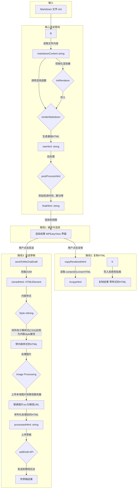

```mermaid
graph TD
    subgraph Input [输入]
        A[Markdown 文件.md]
    end

    subgraph Core_Rendering [核心渲染管线]
    
        B --  读取文件内容 --> C[markdownContent string]        
        C --  初始化渲染器 --> D{initRenderer}
        C --  调用渲染函数 --> E{renderMarkdown}
        D -- 传入 --> E
        E -- 生成基础HTML --> F[rawHtml: string]
        F --  后处理 --> G{postProcessHtml}
        G -- 添加阅读时间、脚注等 --> H[finalHtml: string]
    end

    subgraph Path_Render [路径1: 插件内渲染]
    
        H --  渲染到视图 --> I[渲染结果 MPEasyView 界面]
        
    end

    subgraph Path_Copy [路径2: 复制HTML]
    
        I --  用户点击复制 --> J[copyRenderedHtml]
        J -- 读取 contentDiv.innerHTML --> KcopyHtml
        K -- 写入系统剪贴板 --> L[复制结果 带样式的HTML]
        
    end

    subgraph Path_Draft [路径3: 发送草稿]
    
        I --  用户点击发送 --> M[sendToWeChatDraft]
        M --  克隆DOM --> N[clonedHtml: HTMLElement]
        N --  内联样式 --> O{Style Inlining}
        O -- 将所有计算样式(CSS)应用为内联style属性 --> P[带内联样式的HTML]
        P --  处理图片 --> Q{Image Processing}
        Q -- 上传本地图片到微信服务器 --> R[替换图片src为微信URL]
        R --  序列化处理后的HTML --> S[processedHtml: string]
        S --  上传草稿 --> T{addDraft API}
        T -- 发送到微信后台 --> U[传草稿结果]
        
    end

    A --> B

```